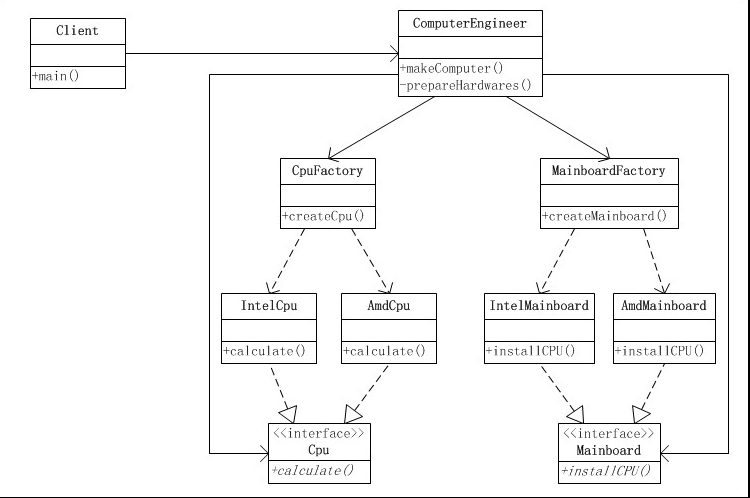

### 抽象工厂
1. 定义
提供一个创建相关或相互依赖对象的接口，而无需指定具体的类。   
**简单工厂--> 工厂方法 -->抽象工厂 **

2. UML  

####Link
- [源码地址](https://github.com/dzhai/design-pattern/tree/master/src/main/java/net/dzhai/dp/creational/abstractfactory)
- [参考](http://www.cnblogs.com/java-my-life/archive/2012/03/28/2418836.html)