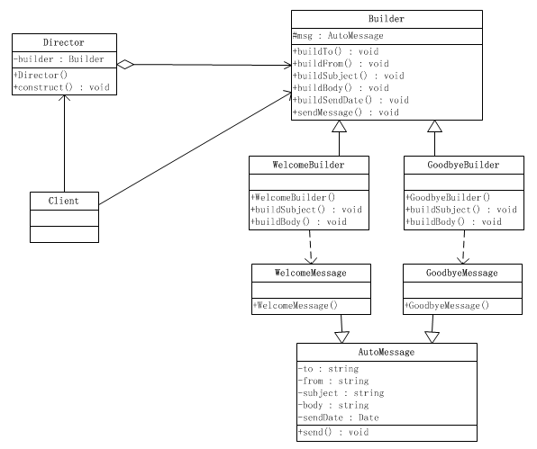

### 构建模式
1. **定义**  
将一个复杂对象的构建与它的表示分离，使得同意的构建过程可以构建不同的表示。  
实现具体的操作与组合的分离
2. **UML**    

  
  
 

1. 一个部分是Builder接口，这里是定义了如何构建各个部件，也就是知道每个部件功能如何实现，以及如何装配这些部件到产品中去；

2. 另外一个部分是Director，Director是知道如何组合来构建产品，也就是说Director负责整体的构建算法，而且通常是分步骤地来执行。

不管如何变化，建造模式都存在这么两个部分，一个部分是部件构造和产品装配，另一个部分是整体构建的算法。认识这点是很重要的，因为在建造模式中，强调的是固定整体构建的算法，而灵活扩展和切换部件的具体构造和产品装配的方式。

　　再直白点说，建造模式的重心在于分离构建算法和具体的构造实现，从而使得构建算法可以重用。具体的构造实现可以很方便地扩展和切换，从而可以灵活地组合来构造出不同的产品对象。

### Link
- [源码地址](https://github.com/dzhai/design-pattern/tree/master/src/main/java/net/dzhai/dp/creational/builder)
- [参考](http://www.cnblogs.com/java-my-life/archive/2012/04/07/2433939.html)
