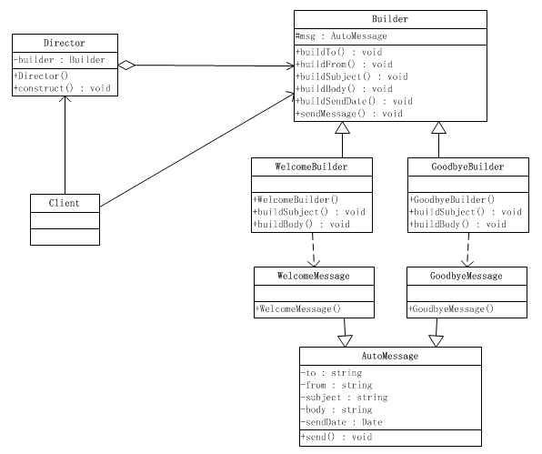

### 构建模式
1. **定义**  
将一个复杂对象的构建与它的表示分离，使得同意的构建过程可以构建不同的表示。  
实现具体的操作与组合的分离
2. **UML**    

  
  
 

### Link
- [源码地址](https://github.com/dzhai/design-pattern/tree/master/src/main/java/net/dzhai/dp/creational/builder)
- [参考](http://www.cnblogs.com/java-my-life/archive/2012/04/07/2433939.html)