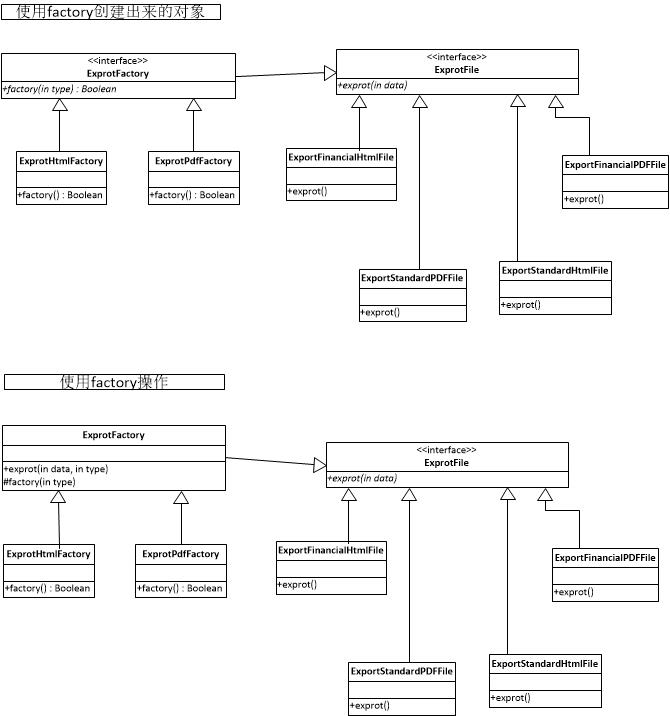

### 工厂方法
1. 定义  
工厂方法模式是类的创建模式，又叫做虚拟构造子(Virtual Constructor)模式或者多态性工厂（Polymorphic Factory）模式。  
工厂方法模式的用意是定义一个创建产品对象的工厂接口，将实际创建工作推迟到子类中。  

2. 说明  
有这么一个需求：XX系统需要支持对数据库中的员工薪资进行导出，并且支持多种格式如：HTML、CSV、PDF等，每种格式导出的结构有所不同，比如：财务跟其他人对导出薪资的HTML格式要求可能会不一样，因为财务可能需要特定的格式方便核算或其他用途。  

如果使用简单工厂模式，则工厂类必定过于臃肿。因为简单工厂模式只有一个工厂类，它需要处理所有的创建的逻辑。假如以上需求暂时只支持3种导出的格式以及2种导出的结构，那工厂类则需要6个if else来创建6种不同的类型。如果日后需求不断增加，则后果不堪设想。  

这时候就需要工厂方法模式来处理以上需求。在工厂方法模式中，核心的工厂类不再负责所有的对象的创建，而是将具体创建的工作交给子类去做。这个核心类则摇身一变，成为了一个抽象工厂角色，仅负责给出具体工厂子类必须实现的接口，而不接触哪一个类应当被实例化这种细节。
这种进一步抽象化的结果，使这种工厂方法模式可以用来允许系统在不修改具体工厂角色的情况下引进新的产品，这一特点无疑使得工厂方法模式具有超过简单工厂模式的优越性。下面就针对以上需求设计UML图

**有两种方式**    
1) 直接使用Factory 进行具体的操作  
2) 使用Factory创建出所需的对象，通过创建的对象进行操作   

#### Link
- [源码地址](https://github.com/dzhai/Demo/tree/master/Designpattern/src/com/d/factory/factorymethod)
- [参考 java_my_life](http://www.cnblogs.com/java-my-life/archive/2012/03/25/2416227.html)
