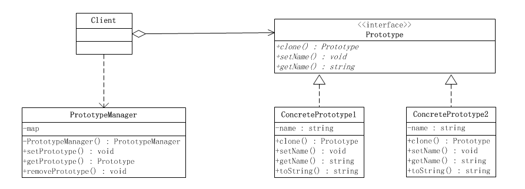

### 原型模式
1. **定义**  
原型模式属于对象的创建模式。通过给出一个原型对象来指明所有创建的对象的类型，然后用复制这个原型对象的办法创建出更多同类型的对象。这就是选型模式的用意
2. **原型模式的结构**  
　　原型模式要求对象实现一个可以“克隆”自身的接口，这样就可以通过复制一个实例对象本身来创建一个新的实例。这样一来，通过原型实例创建新的对象，就不再需要关心这个实例本身的类型，只要实现了克隆自身的方法，就可以通过这个方法来获取新的对象，而无须再去通过new来创建。  
原型模式有两种表现形式：（1）简单形式、（2）登记形式，这两种表现形式仅仅是原型模式的不同实现。  
2. **UML**    
简单形式   
  
登记形式   
 

### Link
- [源码地址](https://github.com/dzhai/design-pattern/tree/master/src/main/java/net/dzhai/dp/creational/prototype)
- [参考](http://www.cnblogs.com/java-my-life/archive/2012/04/11/2439387.html)
