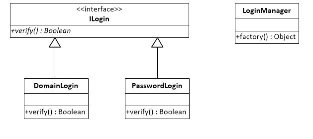

# 简单工厂

## 定义
简单工厂模式是类的创建模式，又叫做静态工厂方法（Static Factory Method）模式。简单工厂模式是由一个工厂对象决定创建出哪一种产品类的实例   

## 实现方式    
假如应用系统需要支持多种登录方式如：口令认证、域认证（口令认证通常是去数据库中验证用户，而域认证则是需要到微软的域中验证用户）。  
那么自然的做法就是建立一个各种登录方式都适用的接口，如下图所示  

