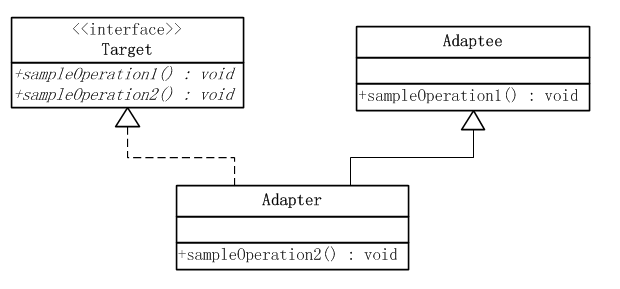
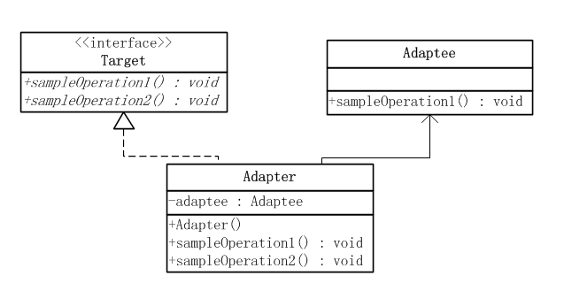

### 原型模式
1. **定义**  
适配器模式把一个类的接口变换成客户端所期待的另一种接口，从而使原本因接口不匹配而无法在一起工作的两个类能够在一起工作
2. ** 适配器模式的结构**  
适配器模式有类的适配器模式和对象的适配器模式两种不同的形式
3. **UML**    
类适配器模式   
  
对象适配器模式     
 

### Link
- [源码地址](https://github.com/dzhai/design-pattern/tree/master/src/main/java/net/dzhai/dp/structural/adapter)
- [参考](http://www.cnblogs.com/java-my-life/archive/2012/04/13/2442795.html)
