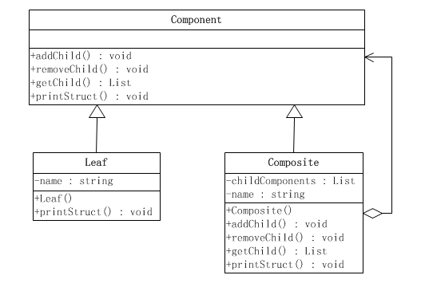

### 原型模式
1. **定义**  
合成模式属于对象的结构模式，有时又叫做“部分——整体”模式。合成模式将对象组织到树结构中，可以用来描述整体与部分的关系。合成模式可以使客户端将单纯元素与复合元素同等看待。  
合成模式把部分和整体的关系用树结构表示出来。合成模式使得客户端把一个个单独的成分对象和由它们复合而成的合成对象同等看待。  
合成模式的实现根据所实现接口的区别分为两种形式，分别称为安全式和透明式。
3. **UML**    
类适配器模式   
  
对象适配器模式     
 

### Link
- [源码地址](https://github.com/dzhai/design-pattern/tree/master/src/main/java/net/dzhai/dp/structural/composite)
- [参考](http://www.cnblogs.com/java-my-life/archive/2012/04/17/2453861.html)
